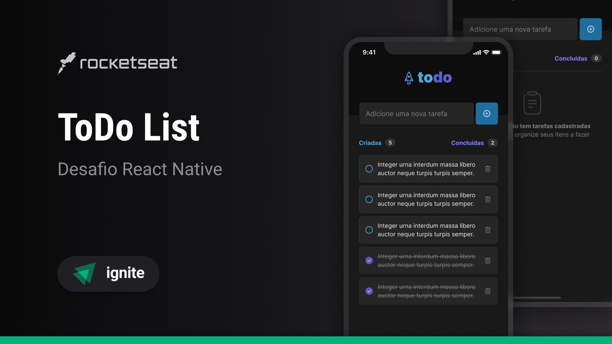

<h1 align="center"> Todo List </h1>

<p align="center">A simple todo list app using React Native, Typescript and Zustand. <br/>


<p align="center">
  <a href="#-tecnologias">Technologies</a>&nbsp;&nbsp;&nbsp;|&nbsp;&nbsp;&nbsp;
  <a href="#-projeto">Project</a>&nbsp;&nbsp;&nbsp;|&nbsp;&nbsp;&nbsp;
  <a href="#-projeto">Execution</a>&nbsp;&nbsp;&nbsp;&nbsp;&nbsp;&nbsp;

</p>

<br>

<p align="center">
  
</p>

## 🚀 Technologies

This project was developed using the following technologies and standards:

- React Native
- Typescript
- Zustand
- Design System
- Styled Components
- Expo Go

## 💻 Project

This project is a Todo List where the user can insert a task and manage it via app

## ⚙️ Execution

Install dependencies and run via Expo Go
```sh
yarn && yarn start
```

---